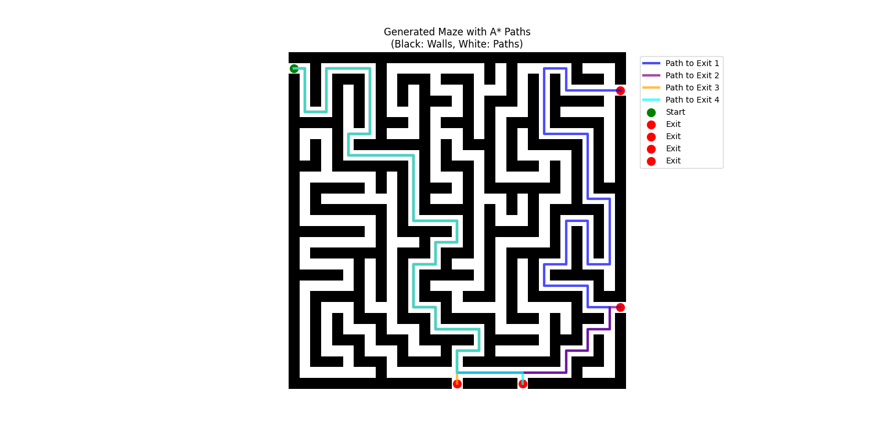

# Maze Solver with A* Algorithm

This project demonstrates the generation and solving of a maze using the **A\*** (A-Star) pathfinding algorithm in Python. It includes:

- Maze generation
- Multiple exits
- A\* algorithm applied to find the shortest path from the start to each exit
- Visualization of paths with color coding

## 📌 Features

- Maze generation with walls (black) and paths (white)
- A\* pathfinding algorithm from start point to multiple exits
- Color-coded path visualization:
  - 💙 Path to Exit 1
  - 💜 Path to Exit 2
  - 🧡 Path to Exit 3
  - 🟦 Path to Exit 4
- Clearly marked start (🟢) and exits (🔴)

## 🖼️ Sample Output

Below is an example visualization of the generated maze with A\* paths:



## 🚀 Getting Started

To run this project, ensure you have Python installed along with the following libraries:

```bash
pip install matplotlib numpy
```

Then run the script:

```bash
python maze_solver.py
```

## 📂 Project Structure

```
.
├── maze_solver.py         # Main script
├── image.png              # Sample output image
└── README.md              # This file
```

## 🧠 Algorithm Details

The A\* algorithm is used for pathfinding due to its efficiency and accuracy. It uses a combination of:

- `g(n)`: the cost from the start node to `n`
- `h(n)`: the heuristic estimated cost from `n` to the goal
- `f(n) = g(n) + h(n)`

## 📃 License

This project is open-source and available under the MIT License.
